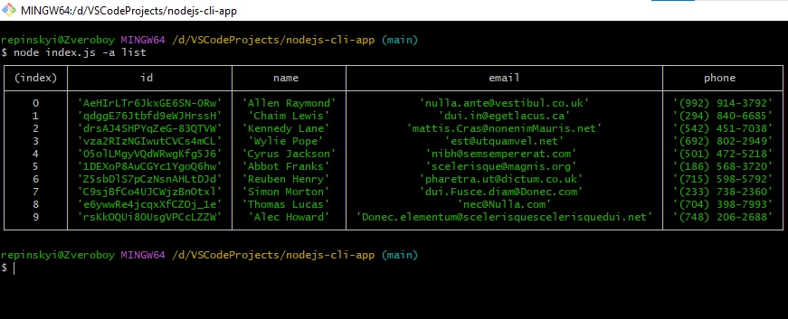
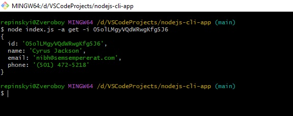
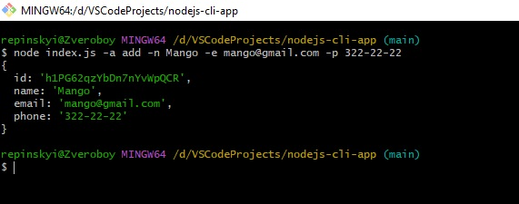
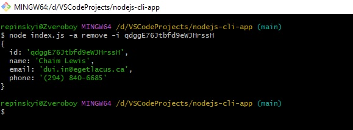
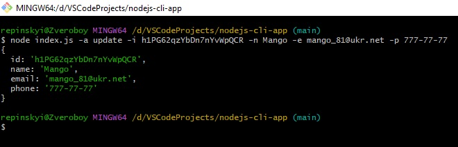

# nodejs-cli-app

### Скріншоти виконання команд:

- #### Отримуємо і виводимо весь список контактів у вигляді таблиці (console.table) 
  node index.js --action="list" 
  [Посилання на скріншот](https://monosnap.com/file/Vy4XRDQzyeSBtPLRsNF306moWD7mFb)

- #### Отримуємо контакт по id і виводимо у консоль об'єкт контакту або null, якщо контакту з таким id не існує. 
  node index.js --action="get" --id 05olLMgyVQdWRwgKfg5J6 
  [Посилання на скріншот](https://monosnap.com/file/gjNl2iYjc9KCeTOHoeBayORvkTQPA8)

- #### Додаємо контакт та виводимо в консоль об'єкт новоствореного контакту 
  node index.js --action="add" --name Mango --email mango@gmail.com --phone 322-22-22 
  [Посилання на скріншот](https://monosnap.com/file/EMbHk4SX7dgSfvJqlW94rLyemP0dI0)

- #### Видаляємо контакт та виводимо в консоль об'єкт видаленого контакту або null, якщо контакту з таким id не існує. 
  node index.js --action="remove" --id qdggE76Jtbfd9eWJHrssH 
  [Посилання на скріншот](https://monosnap.com/file/K2NNeMvQOELIv7wDOx0s5KU78Q7fHD)

- #### Редагуємо (оновлюємо) контакт та виводимо в консоль об'єкт редагованого контакту або null, якщо контакту з таким id не існує. 
  node index.js --action="update" --id h1PG62qzYbDn7nYvWpQCR --name Mango --email mango_81@ukr.net --phone 777-77-77 
  [Посилання на скріншот](https://monosnap.com/file/1WFWPwWyXKsDNZZ4pGWREEn34elh3Y)

